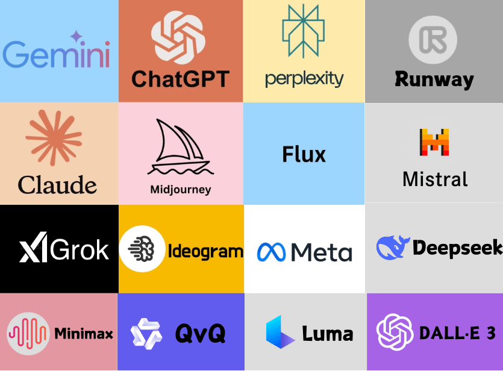

# Fundamentos de ChatGPT y conceptos clave

**Objetivo**: Comprender cómo funciona ChatGPT, su estructura y los conceptos esenciales para interactuar eficazmente.

## Introducción a ChatGP

### **¿Qué es ChatGPT?**

[ChatGPT](https://es.wikipedia.org/wiki/ChatGPT) (Chat Generative Pre-Trained Transformer) es un modelo avanzado de lenguaje desarrollado por OpenAI que utiliza inteligencia artificial para comprender y generar texto de manera coherente. Diseñado para asistir en tareas como responder preguntas, generar contenido, traducir, programar y más, ChatGPT interactúa de forma conversacional, adaptándose a diversos contextos y necesidades.

#### Historia breve de los modelos de lenguaje.

El desarrollo de los [modelos de lenguaje](https://es.wikipedia.org/wiki/Modelaci%C3%B3n_del_lenguaje) está íntimamente ligado al avance del **Procesamiento de Lenguaje Natural (PLN)**, una rama de la Inteligencia Artificial (IA) que busca permitir que las máquinas comprendan, interpreten y generen lenguaje humano de manera efectiva. Desde sus inicios, el [PLN](https://es.wikipedia.org/wiki/Procesamiento_de_lenguajes_naturales) ha evolucionado desde técnicas estadísticas básicas hasta los impresionantes Grandes Modelos de Lenguaje ([LLM](https://es.wikipedia.org/wiki/Modelo_extenso_de_lenguaje)) que conocemos hoy en día.

**Los primeros modelos de lenguaje**
A mediados del siglo XX, con la llegada de la informática, el interés por enseñar a las máquinas a procesar lenguaje humano tomó forma. En esta etapa inicial, se desarrollaron enfoques basados en reglas, donde los sistemas utilizaban gramáticas y diccionarios predefinidos. Ejemplos de estos sistemas incluyen ELIZA (1966), que simulaba una conversación terapéutica, y SHRDLU (1972), diseñado para entender y responder preguntas en un entorno limitado.

Con el tiempo, las técnicas estadísticas comenzaron a reemplazar los enfoques basados en reglas. Durante la década de 1980 y 1990, los modelos n-gram, que predecían palabras basándose en su probabilidad en relación con las palabras anteriores, se volvieron populares. Aunque simples, estos modelos establecieron las bases para trabajos más avanzados.

**Procesamiento de Lenguaje Natural y aprendizaje automático**
En el cambio de milenio, el PLN comenzó a incorporar algoritmos de **aprendizaje automático**. Métodos como las Máquinas de Soporte Vectorial (SVM) y los clasificadores bayesianos fueron empleados para tareas como análisis de sentimiento y categorización de texto. Sin embargo, estos enfoques requerían características cuidadosamente diseñadas a mano, lo que limitaba su escalabilidad y aplicabilidad.

El verdadero cambio ocurrió con el auge del **aprendizaje profundo** en la década de 2010. Los modelos de redes neuronales, como Word2Vec (2013), introdujeron representaciones vectoriales de palabras (embeddings), lo que permitió capturar relaciones semánticas entre palabras. Poco después, las redes recurrentes ([RNN](https://es.wikipedia.org/wiki/Redes_neuronales_recurrentes)) y sus variantes como LSTM y GRU mejoraron la capacidad de los modelos para manejar secuencias de texto más largas.

**La era de los Grandes Modelos de Lenguaje (LLM)**
El avance decisivo llegó con la introducción de los modelos basados en **Transformers**, como el modelo Transformer original (2017). Este diseño, que utiliza mecanismos de atención para procesar datos en paralelo, revolucionó el PLN al superar las limitaciones de las redes recurrentes. En 2018, OpenAI presentó GPT (Generative Pre-trained Transformer), seguido por modelos más avanzados como GPT-2, GPT-3 y GPT-4. Paralelamente, Google desarrolló BERT, diseñado para comprender el contexto bidireccional en el texto.

Los **LLM** modernos como GPT-4 cuentan con miles de millones de parámetros y son preentrenados en enormes corpus de datos textuales. Estos modelos han demostrado capacidades sorprendentes en traducción, generación de texto, programación y razonamiento, marcando un hito en el desarrollo del lenguaje computacional.

**Impacto y futuro**
Hoy en día, los modelos de lenguaje son esenciales en aplicaciones como asistentes virtuales, análisis de datos y educación. Sin embargo, también plantean desafíos éticos, como el sesgo en los datos y el uso indebido. A medida que avanza la IA, se espera que los LLM se integren aún más profundamente en nuestras vidas, cambiando cómo interactuamos con la tecnología y entre nosotros.

Para más información sobre el futuro de la IA leer este artículo 👉 [AI Top-of-Mind for 7.16.24 — Our AI Future](https://medium.com/a-i-society/ai-top-of-mind-for-7-16-24-our-ai-future-07f1bd9b1e41)

**Otras herramientas de IA**

| Nombre de la herramienta | Descripción | Enlace al sitio oficial | Enlace a Wikipedia en inglés |
|--------------------------|-------------|-------------------------|------------------------------|
| **Gemini** | Modelo de lenguaje grande multimodal desarrollado por Google DeepMind, sucesor de LaMDA y PaLM. | [Sitio oficial](https://ai.google/get-started/gemini-ecosystem/) | No disponible |
| **ChatGPT** | Asistente conversacional desarrollado por OpenAI basado en modelos de lenguaje, útil para responder preguntas, generar texto y ayudar en tareas específicas. | [Sitio oficial](https://chat.openai.com/) | [Wikipedia](https://en.wikipedia.org/wiki/ChatGPT) |
| **Perplexity** | Motor de búsqueda conversacional que utiliza modelos de lenguaje para responder consultas con fuentes verificadas. | [Sitio oficial](https://www.perplexity.ai/) | [Wikipedia](https://en.wikipedia.org/wiki/Perplexity_AI) |
| **Runway** | Empresa estadounidense que se especializa en investigación y tecnologías de inteligencia artificial generativa, enfocada en la creación de productos y modelos para generar videos, imágenes y contenido multimedia. | [Sitio oficial](https://runwayml.com/) | [Wikipedia](https://en.wikipedia.org/wiki/Runway_%28company%29) |
| **Claude** | Familia de modelos de lenguaje grandes desarrollados por Anthropic, con énfasis en la seguridad y controlabilidad de la IA. | [Sitio oficial](https://claude.ai/) | [Wikipedia](https://en.wikipedia.org/wiki/Claude_%28language_model%29) |
| **MidJourney** | Herramienta especializada en la generación de imágenes mediante texto, popular en diseño gráfico y arte digital. | [Sitio oficial](https://www.midjourney.com/) | No disponible |
| **Flux** | Modelo de texto a imagen desarrollado por Black Forest Labs, que genera imágenes a partir de descripciones en lenguaje natural. | [Sitio oficial](https://blackforestlabs.ai/) | [Wikipedia](https://en.wikipedia.org/wiki/Flux_%28text-to-image_model%29) |
| **Mistral** | Modelo de lenguaje de código abierto que busca competir con grandes actores de IA, ofreciendo soluciones de generación de texto. | [Sitio oficial](https://www.mistral.ai/) | No disponible |
| **Grok** | Asistente de IA integrado en plataformas como Slack, diseñado para la automatización y análisis de conversaciones en equipo. | [Sitio oficial](https://slack.com/intl/en-gb/blog/news/grok-ai-assistant) | No disponible |
| **Ideogram** | Herramienta para la generación de texto en imágenes, como carteles o diseños gráficos con fuentes estilizadas. | [Sitio oficial](https://ideogram.ai/) | No disponible |
| **Meta** | Empresa detrás de proyectos avanzados de IA como LLaMA, enfocados en la investigación y desarrollo de modelos de lenguaje e IA generativa. | [Sitio oficial](https://about.meta.com/) | [Wikipedia](https://en.wikipedia.org/wiki/Meta_Platforms) |
| **Deepseek** | Plataforma para búsqueda avanzada que combina capacidades de IA y procesamiento del lenguaje natural. | [Sitio oficial](https://deepseek.io/) | No disponible |
| **Minimax** | Herramienta que ofrece soluciones de IA integradas, como chatbots y modelos personalizados para empresas. | [Sitio oficial](https://www.minimax.com/) | No disponible |
| **QvQ** | Proyecto menos conocido, posiblemente relacionado con modelos de simulación o computación cuántica aplicada a la IA. | [Sitio oficial](https://qvq.ai/) | No disponible |
| **Luma** | Plataforma de IA para la creación y edición de contenido en 3D, como renderizados y animaciones. | [Sitio oficial](https://lumalabs.ai/) | No disponible |
| **DALL·E 3** | Modelo de OpenAI diseñado para generar imágenes a partir de descripciones en texto con una calidad y precisión mejoradas. | [Sitio oficial](https://openai.com/dall-e-3) | [Wikipedia](https://en.wikipedia.org/wiki/DALL-E) |

#### Cómo se entrenan (procesamiento de texto masivo y aprendizaje supervisado)

El entrenamiento de los **grandes modelos de lenguaje (LLM)**, como GPT, sigue un proceso complejo que combina el procesamiento de texto masivo y técnicas de aprendizaje supervisado y no supervisado.

1. **Procesamiento de texto masivo**
    Los LLM se entrenan en grandes cantidades de datos textuales provenientes de libros, sitios web, artículos, foros y más. Estos textos se limpian para eliminar información irrelevante o inapropiada, como duplicados, errores ortográficos extremos o contenido que viola estándares éticos. Luego, el texto se tokeniza, dividiéndose en fragmentos pequeños (como palabras o subpalabras) que el modelo puede procesar.

2. **Preentrenamiento no supervisado**
    El modelo comienza con un preentrenamiento en el que aprende a predecir la siguiente palabra en una secuencia de texto o a llenar palabras faltantes. Esto utiliza un enorme corpus de texto sin necesidad de etiquetas humanas. Técnicas como el **enmascaramiento bidireccional** (en modelos como BERT) o la predicción de la siguiente palabra (en GPT) permiten al modelo captar relaciones semánticas y patrones lingüísticos.

3. **Ajuste fino (aprendizaje supervisado)**
    Tras el preentrenamiento, los modelos suelen someterse a un ajuste fino utilizando conjuntos de datos más pequeños y específicos, etiquetados por humanos. Este paso los adapta a tareas concretas, como traducción, generación de texto o soporte técnico.

4. **Retroalimentación humana**
    Para mejorar la calidad de las respuestas, los modelos pueden entrenarse usando **aprendizaje por refuerzo a partir de retroalimentación humana (RLHF)**, donde evaluadores humanos clasifican las respuestas del modelo, guiándolo hacia respuestas más útiles y precisas.

### **¿Cómo funciona ChatGPT?**

ChatGPT se basa en los **Transformers**, una arquitectura de redes neuronales que utiliza un mecanismo de atención para procesar y generar texto. Su capacidad para interpretar y responder a las entradas de los usuarios depende de su entrenamiento en enormes cantidades de datos textuales y del uso de algoritmos avanzados que priorizan el contexto y las relaciones entre palabras.

#### Generación de texto basada en predicciones probabilísticas
El núcleo del funcionamiento de ChatGPT es su capacidad para generar texto previendo cuál será la próxima palabra más probable en función del contexto. Durante el entrenamiento:  

1. **Tokenización**: El texto de entrada se convierte en tokens (fracciones de palabras o subpalabras). Por ejemplo, "Hola, ¿cómo estás?" podría dividirse en "[Hola, ,, ¿, cómo, estás, ?]".  
   
2. **Asignación de probabilidad**: El modelo calcula la probabilidad de cada posible token siguiente en función de los tokens anteriores. Por ejemplo, después de "Hola, ¿cómo", las palabras "estás" o "te va" tienen altas probabilidades, pero palabras como "computadora" tienen probabilidades mucho menores.  

3. **Selección y generación**: El modelo elige el token más probable (o una combinación ponderada para mayor variabilidad) y lo añade a la secuencia generada. Este proceso continúa hasta que se alcanza una longitud deseada o un token de finalización.

#### Cómo ChatGPT interpreta las entradas de los usuarios
Cuando un usuario envía un mensaje, ChatGPT procesa el texto de entrada como un todo, capturando no solo las palabras individuales, sino también sus relaciones en el contexto. Esto se logra mediante:

- **Mecanismo de atención**: Cada palabra de la entrada influye en las demás según su relevancia, permitiendo que el modelo entienda dependencias incluso en frases largas o complejas.
- **Contexto acumulativo**: ChatGPT considera no solo el mensaje más reciente, sino también el historial de la conversación. Esto le permite ofrecer respuestas coherentes y relevantes en interacciones más largas.

#### Cómo ChatGPT genera respuestas
Basándose en el contexto proporcionado, el modelo predice y genera la respuesta token por token.
- Si el usuario pregunta algo ambiguo, el modelo intenta dar una respuesta general o solicita aclaraciones.
- Si la entrada es específica, busca patrones en su conocimiento preentrenado para proporcionar detalles precisos.

En resumen, ChatGPT utiliza cálculos probabilísticos y el contexto proporcionado para generar texto fluido y relevante. Su diseño lo hace capaz de adaptarse a diferentes estilos, interpretar la intención detrás de las entradas y producir respuestas útiles.

## Concepto de tokens

### Definición de un token
- **Palabras, partes de palabras y caracteres especiales.**
Un [token](https://help.openai.com/en/articles/4936856-what-are-tokens-and-how-to-count-them) es la unidad básica de texto que los modelos de lenguaje procesan, como palabras completas, fragmentos de palabras o caracteres especiales. Por ejemplo, "programación" puede dividirse en varios tokens dependiendo del modelo utilizado.

- **Relación entre tokens y la longitud de las respuestas.**
La longitud de las respuestas está limitada por el número total de tokens que el modelo puede procesar en una interacción, incluyendo entrada y salida. Respuestas más largas utilizan más tokens, reduciendo el espacio disponible para el contexto.

### Límites de tokens en ChatGPT

#### ¿Por qué es importante comprender estos límites?
Porque en un chat, la cantidad de tokens es limitada. En la medida en que se aproxima al límite de tokens, las respuestas pierden precisión. Cuando se alcanza el límite de tokens se debe iniciar un nuevo chat.

El límite de tokens para el modelo ChatGPT Plus con GPT-4 turbo es de 128,000 tokens por conversación (aproximadamente 90 páginas de texto). Esto incluye tanto los tokens del texto de entrada como los de salida.

#### Ejemplo práctico: cómo calcular tokens
Una regla práctica útil es que un token generalmente corresponde a ~4 caracteres de texto en inglés común. Esto se traduce aproximadamente a ¾ de una palabra (por lo tanto, 100 tokens equivalen aproximadamente a 75 palabras).

👉 [Tokenizador](https://platform.openai.com/tokenizer) para calcular la cantidad de tokens de un texto.

## Ingeniería de prompts

### ¿Qué es y por qué es importante?

La **ingeniería de *prompts*** es el proceso de diseñar y optimizar *prompts* que se utilizan en modelos de procesamiento del lenguaje natural (PLN), como ChatGPT, chatbots o asistentes virtuales. Esto implica crear indicaciones que sean claras, concisas y eficaces para obtener la respuesta deseada.

### Técnicas clave:

1. **Ser específico:** cuantos más criterios se proporcionen, más específico será el resultado.
2. **Trabajar por pasos:** dividir las tareas en fragmentos pequeños. Esto arrojará mejores resultados, tal como lo haría un humano.
3. **Iterar y mejorar:** vuelver a trabajar las entradas editándolas para que ChatGPT mejore su propio resultado.

### Ejemplos prácticos:

Ver caprpeta de prompts aquí 👉 [Prompts](https://github.com/grobiglio/IA-Tools/tree/main/Prompts)

Ver los siguientes prompts archivados:
    - [Corrección de Informe Técnico](https://chatgpt.com/share/6799109e-e5d4-800d-ab2c-ec7ff5d9bf2c)
    - [Informe del área](https://chatgpt.com/share/67991053-a638-800d-8003-3e592b221f1b)

## Limitaciones y buenas prácticas

### **Limitaciones del modelo**  

- **Datos desactualizados**: ChatGPT no tiene acceso en tiempo real a internet, por lo que su conocimiento puede estar desactualizado. Para información reciente, es recomendable contrastar con fuentes externas actualizadas.  
- **Respuestas generadas incorrectas o "alucinaciones"**: El modelo puede generar respuestas incorrectas o inventadas de manera convincente. Esto ocurre porque predice texto en función de patrones, sin una comprensión real de la veracidad de la información.  

### **Buenas prácticas para interactuar**  

- **Validar información técnica**: No asumir que la respuesta es correcta sin verificarla. Contrastarla con documentación oficial, artículos revisados o expertos en el tema.  
- **Combinar ChatGPT con otras herramientas para mejorar resultados**: Usar ChatGPT junto con motores de búsqueda, bases de datos especializadas o software específico para obtener información más precisa y confiable.