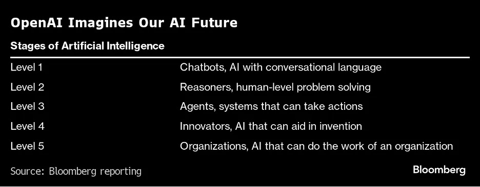

# Introducción General a ChatGPT: Conceptos Fundamentales y Uso Eficiente

Basado en el curso de Udemy [ChatGPT Complete Guide: Learn Generative AI, ChatGPT & More](https://www.udemy.com/course/complete-ai-guide/?couponCode=KEEPLEARNING)

## Objetivo
Familiarizar a los participantes con el funcionamiento básico de ChatGPT, incluyendo conceptos clave como ingeniería de prompts, tokens y las herramientas integradas para optimizar su uso.

## Contenido

- Markdown
- Fundamentos de ChatGPT y conceptos clave

### Markdown

**Objetivo:** Introducir a los participantes en el uso básico de Markdown para estructurar y formatear texto de manera eficiente.

#### ¿Qué es Markdown?

[Markdown](https://es.wikipedia.org/wiki/Markdown) es un lenguaje de marcado ligero que permite formatear texto utilizando una sintaxis simple.

**Ventajas sobre otros editores:** es fácil de leer y escribir, y el resultado es limpio y bien estructurado.

**Utilidad de Markdown**  
- Creación de documentación técnica.  
- Estructuración de reportes y presentaciones.  
- Integración con plataformas como GitHub, Bitbucket, etc.
- Es el lenguaje que usa ChatGPT.

#### Sintaxis básica de Markdown

**Títulos y encabezados:**

- Uso de `#` para encabezados de diferentes niveles.  
- Ejemplo:
    ```markdown
    # Título de nivel 1
    ## Título de nivel 2
    ### Título de nivel 3
    ```

**Listas:**  
- Listas numeradas y no numeradas.  
- Ejemplo:
    ```markdown
    - Elemento de lista
    - Otro elemento de lista
    1. Elemento numerado
    2. Otro elemento numerado
    ```

**Negrita, cursiva y enlaces:**
- Cómo resaltar texto, crear enlaces y agregar imágenes.  
- Ejemplo:
    ```markdown
    **Texto en negrita**
    *Texto en cursiva*
    [Enlace a un sitio web](http://example.com)
    
    ```

**Bloques de código:**
- Formateo de código con comillas invertidas (backticks).  
- Ejemplo:
    ```markdown
    `Código en línea`
    ```
    ```markdown
    ```python
    print("Hola, mundo")
    ```
    ```

**Tablas:**
- Cómo crear tablas para organizar información.
- Ejemplo:
    ```markdown
    | Columna 1 | Columna 2 | Columna 3 |
    |-----------|-----------|-----------|
    | Fila 1    | Dato 1    | Dato 2    |
    | Fila 2    | Dato 3    | Dato 4    |
    ```

**Citas y comentarios:**
- Cómo agregar citas y comentarios para mayor claridad.
- Ejemplo:
    ```markdown
    > Esto es una cita.
    <!-- Esto es un comentario -->
    ```

**Listas de tareas:**
- Creación de listas de tareas con casillas de verificación.  
- Ejemplo:
    ```markdown
    - [ ] Tarea 1
    - [x] Tarea completada
    ```

En los siguientes enlaces hay más y muy completa información para aprender Markdown:
- [The Ultimate Markdown Guide](https://medium.com/analytics-vidhya/the-ultimate-markdown-guide-for-jupyter-notebook-d5e5abf728fd)
- [Basic writing and formatting syntax](https://docs.github.com/en/get-started/writing-on-github/getting-started-with-writing-and-formatting-on-github/basic-writing-and-formatting-syntax)
- [Markdown Guide](https://www.markdownguide.org/)
- [Markdown Preview](https://www.digitalocean.com/community/markdown)

#### Editores y plataformas

- [Visual Studio Code](https://code.visualstudio.com/) u otro editor de texto compatible con Markdown.  
- [GitHub](https://github.com/) u otras plataformas.

### Fundamentos de ChatGPT y conceptos clave

**Objetivo**: Comprender cómo funciona ChatGPT, su estructura y los conceptos esenciales para interactuar eficazmente.

#### Introducción a ChatGP

##### **¿Qué es ChatGPT?**

[ChatGPT](https://es.wikipedia.org/wiki/ChatGPT) (Chat Generative Pre-Trained Transformer) es un modelo avanzado de lenguaje desarrollado por OpenAI que utiliza inteligencia artificial para comprender y generar texto de manera coherente. Diseñado para asistir en tareas como responder preguntas, generar contenido, traducir, programar y más, ChatGPT interactúa de forma conversacional, adaptándose a diversos contextos y necesidades.

###### Historia breve de los modelos de lenguaje.

El desarrollo de los [modelos de lenguaje](https://es.wikipedia.org/wiki/Modelaci%C3%B3n_del_lenguaje) está íntimamente ligado al avance del **Procesamiento de Lenguaje Natural (PLN)**, una rama de la Inteligencia Artificial (IA) que busca permitir que las máquinas comprendan, interpreten y generen lenguaje humano de manera efectiva. Desde sus inicios, el [PLN](https://es.wikipedia.org/wiki/Procesamiento_de_lenguajes_naturales) ha evolucionado desde técnicas estadísticas básicas hasta los impresionantes Grandes Modelos de Lenguaje ([LLM](https://es.wikipedia.org/wiki/Modelo_extenso_de_lenguaje)) que conocemos hoy en día.

**Los primeros modelos de lenguaje**
A mediados del siglo XX, con la llegada de la informática, el interés por enseñar a las máquinas a procesar lenguaje humano tomó forma. En esta etapa inicial, se desarrollaron enfoques basados en reglas, donde los sistemas utilizaban gramáticas y diccionarios predefinidos. Ejemplos de estos sistemas incluyen ELIZA (1966), que simulaba una conversación terapéutica, y SHRDLU (1972), diseñado para entender y responder preguntas en un entorno limitado.

Con el tiempo, las técnicas estadísticas comenzaron a reemplazar los enfoques basados en reglas. Durante la década de 1980 y 1990, los modelos n-gram, que predecían palabras basándose en su probabilidad en relación con las palabras anteriores, se volvieron populares. Aunque simples, estos modelos establecieron las bases para trabajos más avanzados.

**Procesamiento de Lenguaje Natural y aprendizaje automático**
En el cambio de milenio, el PLN comenzó a incorporar algoritmos de **aprendizaje automático**. Métodos como las Máquinas de Soporte Vectorial (SVM) y los clasificadores bayesianos fueron empleados para tareas como análisis de sentimiento y categorización de texto. Sin embargo, estos enfoques requerían características cuidadosamente diseñadas a mano, lo que limitaba su escalabilidad y aplicabilidad.

El verdadero cambio ocurrió con el auge del **aprendizaje profundo** en la década de 2010. Los modelos de redes neuronales, como Word2Vec (2013), introdujeron representaciones vectoriales de palabras (embeddings), lo que permitió capturar relaciones semánticas entre palabras. Poco después, las redes recurrentes ([RNN](https://es.wikipedia.org/wiki/Redes_neuronales_recurrentes)) y sus variantes como LSTM y GRU mejoraron la capacidad de los modelos para manejar secuencias de texto más largas.

**La era de los Grandes Modelos de Lenguaje (LLM)**
El avance decisivo llegó con la introducción de los modelos basados en **Transformers**, como el modelo Transformer original (2017). Este diseño, que utiliza mecanismos de atención para procesar datos en paralelo, revolucionó el PLN al superar las limitaciones de las redes recurrentes. En 2018, OpenAI presentó GPT (Generative Pre-trained Transformer), seguido por modelos más avanzados como GPT-2, GPT-3 y GPT-4. Paralelamente, Google desarrolló BERT, diseñado para comprender el contexto bidireccional en el texto.

Los **LLM** modernos como GPT-4 cuentan con miles de millones de parámetros y son preentrenados en enormes corpus de datos textuales. Estos modelos han demostrado capacidades sorprendentes en traducción, generación de texto, programación y razonamiento, marcando un hito en el desarrollo del lenguaje computacional.

**Impacto y futuro**
Hoy en día, los modelos de lenguaje son esenciales en aplicaciones como asistentes virtuales, análisis de datos y educación. Sin embargo, también plantean desafíos éticos, como el sesgo en los datos y el uso indebido. A medida que avanza la IA, se espera que los LLM se integren aún más profundamente en nuestras vidas, cambiando cómo interactuamos con la tecnología y entre nosotros.



Para más información sobre el futuro de la IA leer este artículo 👉 [AI Top-of-Mind for 7.16.24 — Our AI Future](https://medium.com/a-i-society/ai-top-of-mind-for-7-16-24-our-ai-future-07f1bd9b1e41)

###### Cómo se entrenan (procesamiento de texto masivo y aprendizaje supervisado)

El entrenamiento de los **grandes modelos de lenguaje (LLM)**, como GPT, sigue un proceso complejo que combina el procesamiento de texto masivo y técnicas de aprendizaje supervisado y no supervisado.

1. **Procesamiento de texto masivo**
    Los LLM se entrenan en grandes cantidades de datos textuales provenientes de libros, sitios web, artículos, foros y más. Estos textos se limpian para eliminar información irrelevante o inapropiada, como duplicados, errores ortográficos extremos o contenido que viola estándares éticos. Luego, el texto se tokeniza, dividiéndose en fragmentos pequeños (como palabras o subpalabras) que el modelo puede procesar.

2. **Preentrenamiento no supervisado**
    El modelo comienza con un preentrenamiento en el que aprende a predecir la siguiente palabra en una secuencia de texto o a llenar palabras faltantes. Esto utiliza un enorme corpus de texto sin necesidad de etiquetas humanas. Técnicas como el **enmascaramiento bidireccional** (en modelos como BERT) o la predicción de la siguiente palabra (en GPT) permiten al modelo captar relaciones semánticas y patrones lingüísticos.

3. **Ajuste fino (aprendizaje supervisado)**
    Tras el preentrenamiento, los modelos suelen someterse a un ajuste fino utilizando conjuntos de datos más pequeños y específicos, etiquetados por humanos. Este paso los adapta a tareas concretas, como traducción, generación de texto o soporte técnico.

4. **Retroalimentación humana**
    Para mejorar la calidad de las respuestas, los modelos pueden entrenarse usando **aprendizaje por refuerzo a partir de retroalimentación humana (RLHF)**, donde evaluadores humanos clasifican las respuestas del modelo, guiándolo hacia respuestas más útiles y precisas.

##### **¿Cómo funciona ChatGPT?**

ChatGPT se basa en los **Transformers**, una arquitectura de redes neuronales que utiliza un mecanismo de atención para procesar y generar texto. Su capacidad para interpretar y responder a las entradas de los usuarios depende de su entrenamiento en enormes cantidades de datos textuales y del uso de algoritmos avanzados que priorizan el contexto y las relaciones entre palabras.

###### Generación de texto basada en predicciones probabilísticas
El núcleo del funcionamiento de ChatGPT es su capacidad para generar texto previendo cuál será la próxima palabra más probable en función del contexto. Durante el entrenamiento:  

1. **Tokenización**: El texto de entrada se convierte en tokens (fracciones de palabras o subpalabras). Por ejemplo, "Hola, ¿cómo estás?" podría dividirse en "[Hola, ,, ¿, cómo, estás, ?]".  
   
2. **Asignación de probabilidad**: El modelo calcula la probabilidad de cada posible token siguiente en función de los tokens anteriores. Por ejemplo, después de "Hola, ¿cómo", las palabras "estás" o "te va" tienen altas probabilidades, pero palabras como "computadora" tienen probabilidades mucho menores.  

3. **Selección y generación**: El modelo elige el token más probable (o una combinación ponderada para mayor variabilidad) y lo añade a la secuencia generada. Este proceso continúa hasta que se alcanza una longitud deseada o un token de finalización.

###### Cómo ChatGPT interpreta las entradas de los usuarios
Cuando un usuario envía un mensaje, ChatGPT procesa el texto de entrada como un todo, capturando no solo las palabras individuales, sino también sus relaciones en el contexto. Esto se logra mediante:

- **Mecanismo de atención**: Cada palabra de la entrada influye en las demás según su relevancia, permitiendo que el modelo entienda dependencias incluso en frases largas o complejas.
- **Contexto acumulativo**: ChatGPT considera no solo el mensaje más reciente, sino también el historial de la conversación. Esto le permite ofrecer respuestas coherentes y relevantes en interacciones más largas.

###### Cómo ChatGPT genera respuestas
Basándose en el contexto proporcionado, el modelo predice y genera la respuesta token por token.  
- Si el usuario pregunta algo ambiguo, el modelo intenta dar una respuesta general o solicita aclaraciones.  
- Si la entrada es específica, busca patrones en su conocimiento preentrenado para proporcionar detalles precisos.  

En resumen, ChatGPT utiliza cálculos probabilísticos y el contexto proporcionado para generar texto fluido y relevante. Su diseño lo hace capaz de adaptarse a diferentes estilos, interpretar la intención detrás de las entradas y producir respuestas útiles.

---

## Material de soporte

### Apuntes

Acceder desde 👉 [aquí](https://fadeasa-my.sharepoint.com/:f:/g/personal/robiglio_fadeasa_com_ar/Eria57XL0fFGorIPXN18dnwB244nMNau94q5K65IpPCKwA?e=lAFxyo) a los apuntes.

### Lista de artículos

- [ChatGPT vs. Google](https://leapyearlearning.mykajabi.com/blog/chatgpt-vs-google-key-differences-and-when-to-use-each)
- [Comparing ChatGPT-4o, ChatGPT-4o Mini, and ChatGPT-4](https://leapyearlearning.mykajabi.com/blog/prompts-for-increasing-business-productivity)
- [Prompting](https://leapyearlearning.mykajabi.com/blog/prompting-the-art-of-creating-effective-prompts-for-llm-s)
- [Awesome ChatGPT prompts in GitHub](https://github.com/f/awesome-chatgpt-prompts)
- [What are tokens and how to count them?](https://help.openai.com/en/articles/4936856-what-are-tokens-and-how-to-count-them)
- [Tokenizer](https://platform.openai.com/tokenizer)
- [200 Best ChatGPT Prompts for 2024](https://leapyearlearning.mykajabi.com/blog/week-1)
- [A Comprehensive Look Into Prompt Engineering Fundamentals](https://leapyearlearning.mykajabi.com/blog/a-comprehensive-guide-to-prompt-engineering)