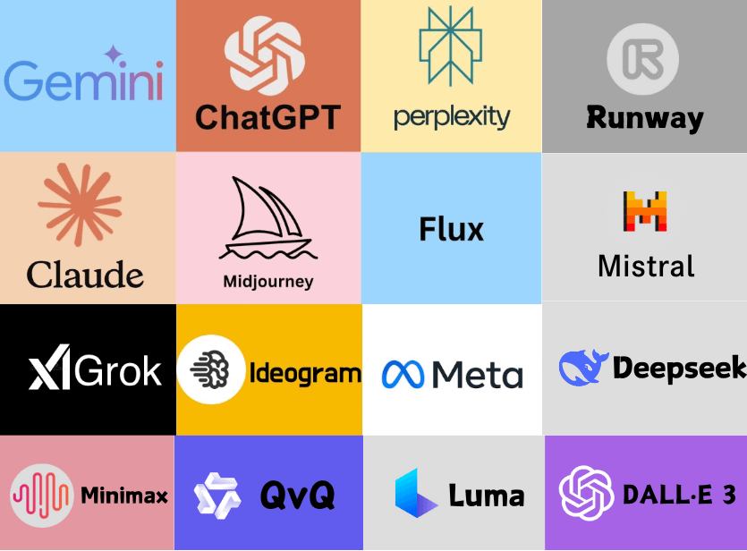

# Herramientas IA  
- **Prompt 1**: _"¿Serías por favor tan amable de brindarme una breve explicación sobre cada una se estas 16 herramientas de Inteligencia Artificial?"_
    Adjuntar esta imagen:
    
- **Prompt 2**: _"Me encantaría una tabla con cuatro columnas: Nombre de la herramienta, la explicación brindada antes, el enlace de acceso al sitio de la herramienta de IA, el enlace de acceso a Wikipedia."_  
- **Prompt 3**: _"Me encanta. Si el sitio tiene página de Wikipedia en inglés también me sirve. ¿Podés buscar si tiene página de Wikipedia en inglés?"_  
- **Prompt 4**: _"¡Muchas gracias, Hal! 😀"_