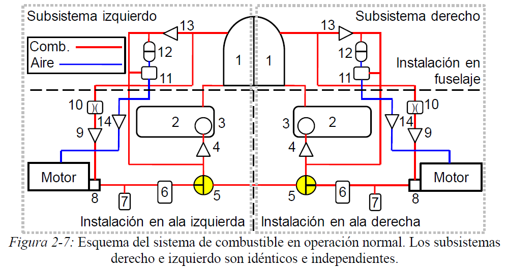

# FMEA de un sistema de combustible

- **Prompt 1:** *Eres un experto en análisis de seguridad de sistemas del avión. Te voy a pedir que completes algunas tareas específicas, pero antes de que respondas, quiero que hagas lo siguiente: Si tienes alguna pregunta sobre mi tarea, o dudas sobre si dar la mejor respuesta posible, haz preguntas con viñetas para aclarar la situación antes de generar tu respuesta. ¿Entendido?*

- **Prompt 2:** *¡Genial! La imagen adjunta corresponde al esquema del sistema de combustible de un avión bimotor. A continuación se encuentra la explicación del funcionamiento del sistema.*

    ---

    Dos tanques de fuselaje (1) con una capacidad de 390 litros c/u se conectan por medio de conductos flexibles de una pulgada de diámetro a respectivos tanques de ala (2) con una capacidad de 250 litros c/u. La alimentación de los tanques de ala es por gravedad desde los tanques de fuselaje. La capacidad total de combustible es de 1280 litros.
    Los tanques de fuselaje se encuentran conectados a la atmósfera por una válvula de gravedad que impide el derramamiento de combustible cuando el avión realiza maniobras con g negativas.
    El combustible es provisto al sistema desde los tanques de ala (2) impulsado por las bombas (3). Aguas abajo de las bombas, el combustible se bifurca en dos direcciones: hacia la unidad de control de combustible (FCU) (8) del motor a través de la válvula de tres vías (5), y hacia el acumulador de vuelo invertido (AVI) (12).
    El combustible que circula hacia la FCU pasa por un filtro (6); aguas abajo del filtro, el interruptor de presión (7) censa la presión de combustible para que, en caso de que esta sea menor a 14.71 psia, active una alarma en cabina.
    La válvula no retorno (4) evita que el combustible circule hacia el tanque en caso de que la alimentación al motor provenga desde el AVI (12). Dado que el caudal provisto por la bomba (3) es mayor al que consume el motor, el combustible excedente es devuelto al tanque de fuselaje (1) después de atravesar la válvula no retorno (13). La válvula no retorno (13) tiene una presión de apertura tal que permite mantener al sistema presurizado e impide que el combustible proveniente de los AVI (12) sea enviado al tanque en lugar de ser enviado a los motores. La válvula de vuelo invertido (11) mantiene bloqueado el paso de aire de sangrado del motor hacia el AVI mientras la presión de combustible supere los 20 psia. En caso de que la presión del sistema de combustible caiga, la válvula de vuelo invertido presurizará el AVI (12), siendo este la fuente de alimentación de combustible en lugar de las bombas (3). La capacidad de los AVI (12) es de 8 litros cada uno. Desde la FCU (8) hay un conducto que se dirige hacia el tanque del fuselaje (1), su función es el cebado del sistema durante el arranque, impidiendo el ingreso de aire a los inyectores del motor. El orificio calibrado (10) obra de restrictor para impedir circulación de combustible mayor a 40 libras por hora (PPH); la válvula no retorno (9) impide que el combustible que se devuelve al tanque circule hacia la FCU.

    ---

    Mi pregunta es: ¿la explicación es clara y comprensible para una persona que va a operar la aeronave? Tu tarea, además de responder SI o NO, es mejorar la explicación si entendés que esto es posible. Por favor, haz cualquier pregunta que tengas para que pueda mejorar mi indicación antes de que completes tu tarea.

    Adjuntar el siguiente archivo:
    
- **Prompt 3 (en respuesta a la pregunta que me hizo ChatGPT):** Te explico:
    - El público objetivo son pilotos de la aeronave.
    - El propósito es que el piloto esté familizarizado con el funcionamiento del sistema. El esquema y la explicación, por tanto, formarán parte del manual de operación de la aeronave.
    - Debemos explicar que AVI es el Acumulador de Vuelo Invertido.
    - Valdría la pena cambair la palabra "restrictor" por "orificio calibrado" o "limitador de caudal de combustible".
    - No es necesario explicar el funcionamiento internode los componentes. Prefiero que la explicación se enfoque en el funcionamiento del sistema.
- **Prompt 4:** Me parece magnífica. Ahora necesito que me hagas un Análisis de Modo de Falla y Efectos (FMEA) del sistema teniendo en cuenta lo siguiente:  
  - Piece Part FMEA (FMEA por partes).  
  - Análisis cualitativo.  
  - Contemplar solo simple falla.  
  - Proponer el análisis en forma tabular con las siguientes columnas: ID Falla, Componente, Modo de Falla, Efecto, Efecto sobre el sistema, Efecto en la aeronave, Fase de vuelo, Modo de detección de la tripulación, Severidad, Modo de mitigar la falla.