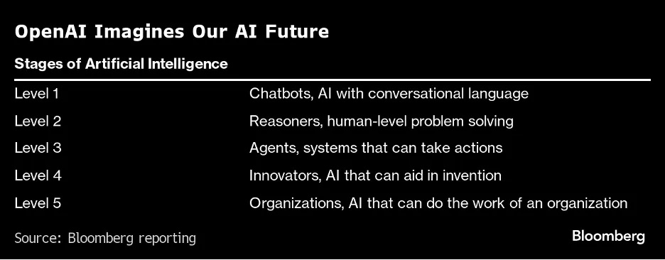

[Inicio](./README.md) | [Anterior (1. Markdown)](./1-Markdown.md) | [Próximo (3. Ingeniería de Prompts)](./3-IngPrompts.md)

---

# Fundamentos de ChatGPT y conceptos clave

**Objetivo**: Comprender cómo funciona ChatGPT, su estructura y los conceptos esenciales para interactuar eficazmente.

## Índice de contenidos

- [Introducción a ChatGPT](#introducción-a-chatgpt)
  - [¿Qué es ChatGPT?](#qué-es-chatgpt)
  - [Breve historia de los modelos de lenguaje](#breve-historia-de-los-modelos-de-lenguaje)
  - [GPT y los grandes modelos actuales](#gpt-y-los-grandes-modelos-actuales)

- [¿Cómo funciona ChatGPT?](#cómo-funciona-chatgpt)
  - [Arquitectura basada en Transformers](#arquitectura-basada-en-transformers)
  - [Generación de texto paso a paso](#generación-de-texto-paso-a-paso)
  - [Contexto y memoria](#contexto-y-memoria)
  - [Instrucciones del sistema y roles](#instrucciones-del-sistema-y-roles)
  - [Capacidad de adaptación](#capacidad-de-adaptación)

- [Concepto de tokens y sus límites](#concepto-de-tokens-y-sus-límites)
  - [¿Qué es un token?](#qué-es-un-token)
  - [¿Para qué sirven los tokens?](#para-qué-sirven-los-tokens)
  - [Límite de tokens por conversación](#límite-de-tokens-por-conversación)
  - [¿Cómo saber cuántos tokens estoy usando?](#cómo-saber-cuantos-tokens-estoy-usando)
  - [¿Por qué es importante entender esto?](#por-qué-es-importante-entender-esto)

- [Limitaciones y buenas prácticas](#limitaciones-y-buenas-prácticas)
  - [Limitaciones del modelo](#limitaciones-del-modelo)
  - [Buenas prácticas para interactuar](#buenas-prácticas-para-interactuar)

- [Proyección futura de la IA](#proyección-futura-de-la-ia)
  - [Aplicaciones emergentes](#aplicaciones-emergentes)
  - [Desafíos y responsabilidades](#desafíos-y-responsabilidades)
  - [¿Qué podemos esperar?](#qué-podemos-esperar)

## Introducción a ChatGPT

### ¿Qué es ChatGPT?

[ChatGPT](https://es.wikipedia.org/wiki/ChatGPT) (Chat Generative Pre-Trained Transformer) es un sistema conversacional basado en inteligencia artificial desarrollado por OpenAI. Utiliza modelos avanzados de lenguaje natural llamados **GPT (Generative Pre-trained Transformer)** para comprender, procesar y generar texto en múltiples idiomas.

ChatGPT es capaz de:
- responder preguntas,
- redactar textos de todo tipo,
- generar código en diversos lenguajes de programación,
- traducir idiomas,
- resumir documentos,
- asistir en tareas académicas y profesionales, entre muchas otras funciones.

Desde 2023, la versión disponible en el plan **ChatGPT Plus** utiliza **GPT-4-turbo**, una variante optimizada de GPT-4 que ofrece mejor rendimiento, mayor velocidad y menor costo operativo. Además, incluye acceso a herramientas como navegador web, visor de archivos, Python (para cálculos, gráficos, análisis de datos) y edición colaborativa con Canvas.

### Breve historia de los modelos de lenguaje

El desarrollo de ChatGPT se inscribe en la evolución del **Procesamiento de Lenguaje Natural (PLN)**, un área de la inteligencia artificial que busca enseñar a las máquinas a comprender, interpretar y generar lenguaje humano.

#### De las reglas al aprendizaje profundo
- **Décadas de 1960-1980:** Los primeros sistemas (como ELIZA y SHRDLU) se basaban en reglas gramaticales simples y bases de datos cerradas.
- **Décadas de 1990-2000:** Se introdujeron los modelos estadísticos como los n-gramas, y algoritmos de aprendizaje automático como Naive Bayes y SVM.
- **Años 2010:** Aparecen los primeros modelos de **aprendizaje profundo**, como Word2Vec y las redes neuronales recurrentes (RNN), capaces de manejar relaciones más complejas entre palabras.

#### La revolución de los Transformers
- En 2017, Google presenta el paper “Attention is All You Need”, que introduce la arquitectura **Transformer**. Esta innovación permite entrenar modelos más grandes, con mejor comprensión contextual.
- En 2018-2020 surgen modelos de lenguaje masivo como **BERT (Google)**, **GPT-2 (OpenAI)** y **T5**, que comienzan a usarse en tareas del mundo real.

#### GPT y los grandes modelos actuales
- **GPT-3 (2020):** Un modelo de 175 mil millones de parámetros que demostró sorprendentes capacidades en redacción, programación y razonamiento.
- **GPT-4 (2023):** Modelo multimodal (puede procesar texto e imágenes), más preciso y seguro.
- **GPT-4-turbo (finales de 2023):** Versión más eficiente de GPT-4 utilizada en ChatGPT Plus. Aunque OpenAI no ha revelado su tamaño exacto, se sabe que es más rápida y económica.

En paralelo, otras empresas han desarrollado modelos competitivos como **Claude (Anthropic)**, **Gemini (Google DeepMind)**, **LLaMA (Meta)** y **Mistral**.

### **¿Cómo funciona ChatGPT?**

ChatGPT funciona a partir de un modelo de lenguaje de gran escala entrenado para predecir texto de forma contextual. Se basa en la arquitectura **Transformer**, que utiliza un mecanismo llamado **atención** para analizar relaciones entre palabras, frases e ideas a lo largo de un texto.

#### Arquitectura basada en Transformers

A diferencia de las redes tradicionales, los Transformers permiten procesar múltiples palabras al mismo tiempo y captar relaciones complejas sin importar la distancia entre términos. Esto mejora la fluidez, coherencia y profundidad de las respuestas.

- El mecanismo de **atención** asigna pesos a cada palabra de entrada en función de su relevancia para otras palabras del contexto.
- Así, el modelo no solo “lee” de forma secuencial, sino que **comprende relaciones globales**, incluso en textos largos o preguntas complejas.

#### Generación de texto paso a paso

1. **Tokenización**  
   El texto que ingresa se divide en pequeñas unidades llamadas *tokens*. Un token puede ser una palabra completa, parte de una palabra o un símbolo especial.  
   Ejemplo:  
   - "inteligencia artificial" → `["int", "eligencia", " artificial"]`

2. **Predicción probabilística**  
   Para cada token generado, el modelo predice cuál es el siguiente token más probable, considerando el contexto previo.  
   No “piensa” ni “busca respuestas”: simplemente **predice texto coherente token por token**, usando estadísticas de millones de ejemplos previos.

3. **Selección del siguiente token**  
   El sistema puede elegir el token más probable, o usar un muestreo ponderado (para hacer la respuesta más creativa o diversa).

Este proceso se repite hasta completar una frase o alcanzar un límite.

#### Contexto y memoria

ChatGPT no analiza frases de manera aislada, sino que considera el **historial de la conversación** dentro de una ventana de contexto (hasta 128.000 tokens en GPT-4-turbo).

- Puede recordar lo que se dijo hace varios mensajes y responder con coherencia.
- En modelos con **memoria activada**, también puede guardar información entre sesiones (por ejemplo, tu nombre o tus preferencias de estilo).

#### Instrucciones del sistema y roles

Al iniciar una conversación, ChatGPT recibe una **instrucción oculta del sistema** (System prompt) que define su comportamiento. Esta instrucción puede indicarle que actúe como tutor, programador, analista, redactor, etc.

Además, el usuario puede modificar esa instrucción para personalizar el estilo de las respuestas.

#### Capacidad de adaptación

ChatGPT es sensible al tono, la intención y el estilo de quien escribe:

- Si el usuario es informal, responde en el mismo tono.
- Si se formulan instrucciones precisas, intenta seguirlas con exactitud.
- Puede generar respuestas resumidas, detalladas, técnicas o creativas según se le indique.

En resumen: ChatGPT analiza tokens, predice texto basado en contexto y estilo, y genera respuestas fluidas gracias a los mecanismos de atención y aprendizaje previo.

## Concepto de tokens

En los modelos de lenguaje como ChatGPT, el texto se procesa en pequeñas unidades llamadas **tokens**.

### ¿Qué es un token?

Un [*token*](https://help.openai.com/en/articles/4936856-what-are-tokens-and-how-to-count-them) es una unidad básica de texto que el modelo utiliza para procesar y generar lenguaje. En términos simples, es como un “trozo” de texto que el modelo entiende y manipula.

Un *token* puede ser:
- Una palabra completa: `mañana`
- Una parte de palabra: `incre`, `íble`
- Un símbolo: `,`, `¡`, `?`
- Un espacio en blanco

Por ejemplo:
- “Hola, ¿cómo estás?” se divide en tokens como: `["Hola", ",", "¿", "cómo", "estás", "?"]`

> Regla general: **1 token ≈ 4 caracteres** o **¾ de palabra en inglés**.

### ¿Para qué sirven los tokens?

Los modelos de lenguaje **no leen frases completas**. En su lugar:
- Dividen el texto en tokens.
- Procesan secuencia por secuencia.
- Calculan probabilidades del siguiente token para generar respuestas.

Tanto la **entrada del usuario** como la **respuesta del modelo** consumen tokens.

### Límite de tokens por conversación

Cada modelo tiene una **ventana de contexto**, que es el máximo número de tokens que puede tener en cuenta en una interacción.

| Modelo              | Límite de tokens |
|---------------------|------------------|
| GPT-3.5             | 16.000           |
| GPT-4-turbo (ChatGPT Plus) | 128.000       |

> Este límite incluye **todo el historial de la conversación**, tanto lo que vos escribís como lo que responde el modelo.

Cuando se alcanza este límite:
- ChatGPT empieza a olvidar los primeros mensajes.
- O bien, el sistema cierra automáticamente la sesión.

### ¿Cómo saber cuántos tokens estoy usando?

Podés usar esta herramienta oficial 👉 [Tokenizador de OpenAI](https://platform.openai.com/tokenizer)

- Pegás un texto y te dice cuántos tokens usa.
- Muy útil para calcular si un texto largo (como un informe o código) entra en una sola interacción.

### ¿Por qué es importante entender esto?

- Si enviás mensajes muy largos, **ChatGPT puede “olvidar” partes anteriores** de la conversación.
- Para tareas como revisión de textos, análisis legales o generación de informes, es clave dividir el trabajo en partes.
- También afecta el **costo** si estás usando la API de OpenAI (se cobra por token usado).

> 📌 Buenas prácticas:
> - Evitá introducir mucho texto innecesario.
> - Si el contexto es largo, recordá que podés resumirlo.
> - Pedí resúmenes parciales o dividí documentos grandes por secciones.

## Limitaciones y buenas prácticas

### **Limitaciones del modelo**  

- **Datos desactualizados**: ChatGPT no tiene acceso en tiempo real a internet, por lo que su conocimiento puede estar desactualizado. Para información reciente, es recomendable contrastar con fuentes externas actualizadas.  
- **Respuestas generadas incorrectas o "alucinaciones"**: El modelo puede generar respuestas incorrectas o inventadas de manera convincente. Esto ocurre porque predice texto en función de patrones, sin una comprensión real de la veracidad de la información.  

### **Buenas prácticas para interactuar**  

- **Validar información técnica**: No asumir que la respuesta es correcta sin verificarla. Contrastarla con documentación oficial, artículos revisados o expertos en el tema.  
- **Combinar ChatGPT con otras herramientas para mejorar resultados**: Usar ChatGPT junto con motores de búsqueda, bases de datos especializadas o software específico para obtener información más precisa y confiable.

## Proyección futura de la IA

A medida que los modelos de lenguaje se expanden en capacidad y uso, su impacto en nuestras vidas seguirá creciendo. Estas tecnologías están transformando sectores clave como la educación, la salud, la ingeniería, la atención al cliente y la creatividad digital.

### Aplicaciones emergentes
Los LLM (Modelos de Lenguaje de Gran Escala) ya están siendo utilizados para:
- Automatizar tareas repetitivas o complejas.
- Asistir en el desarrollo de software y generación de contenido técnico.
- Realizar análisis avanzados de grandes volúmenes de texto.
- Integrarse en flujos de trabajo colaborativos en empresas.

### Desafíos y responsabilidades
Sin embargo, este avance trae consigo importantes desafíos:
- **Sesgos en los datos**: los modelos reflejan (y a veces amplifican) prejuicios presentes en sus datos de entrenamiento.
- **Desinformación**: pueden generar respuestas incorrectas con un tono convincente.
- **Privacidad y uso ético**: se debate el uso adecuado de estos modelos en contextos sensibles.

La comunidad técnica, legal y social deberá trabajar en conjunto para establecer marcos de gobernanza y uso responsable de la IA.

### ¿Qué podemos esperar?
- Mayor integración de modelos multimodales (texto, imagen, audio, video).
- Ampliación de las ventanas de contexto (hasta millones de tokens).
- Modelos con capacidad de ejecutar acciones, interactuar con otras aplicaciones y **aprender de cada usuario** (mediante memorias personalizadas).

> En resumen: la IA generativa no es solo una herramienta más —es un cambio de paradigma en cómo accedemos, producimos y estructuramos conocimiento.

🧭 Para explorar ideas y predicciones en detalle, podés leer este artículo 👉 [AI Top-of-Mind for 7.16.24 — Our AI Future](https://medium.com/a-i-society/ai-top-of-mind-for-7-16-24-our-ai-future-07f1bd9b1e41)

---
[Inicio](./README.md) | [Anterior (1. Markdown)](./1-Markdown.md) | [Próximo (3. Ingeniería de Prompts)](./3-IngPrompts.md)