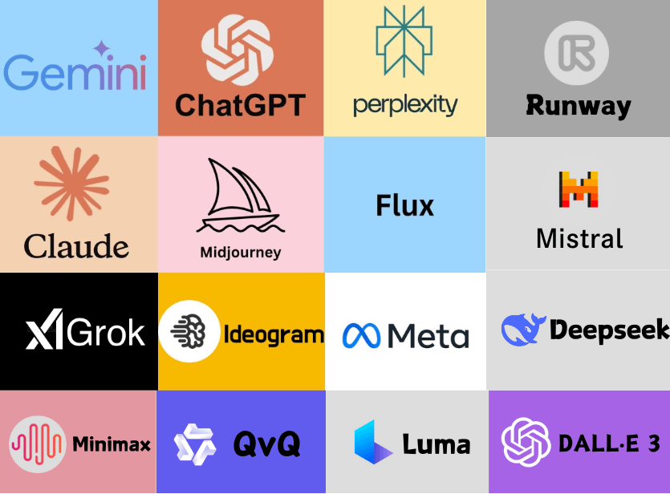

[Inicio](./README.md) | [Anterior (4. Ingeniería de Prompts)](./3-IngPrompts.md)

---

# Herramientas y funcionalidades

## Herramientas nativas de ChatGPT (2025)

* **Proyectos:** permiten agrupar chats, archivos y configuraciones en un mismo espacio de trabajo. Son ideales para cursos, investigaciones o trabajos de certificación.
* **Memoria persistente:** ChatGPT puede recordar información entre sesiones (ejemplo: tu nombre, estilo de redacción o contexto de un proyecto). Esto agiliza el trabajo continuo.
* **Búsqueda integrada en la web:** ChatGPT puede consultar internet en tiempo real para brindar respuestas actualizadas con fuentes.
* **Visor y análisis de archivos:** admite múltiples formatos (PDF, Word, Excel, imágenes, CSV, código, etc.). Permite hacer resúmenes, gráficos o cálculos directamente.
* **Ejecutar código (Python):** entorno integrado para cálculos, gráficos, análisis de datos o generación de archivos.
* **Tareas programadas:** se pueden crear recordatorios y automatizaciones que ChatGPT ejecuta en segundo plano, incluso si no estás en línea.
* **Multimodalidad:** GPT-5 procesa texto, imágenes y audio en la misma conversación. Esto permite subir gráficos, fotos o grabaciones y obtener análisis integrado.
* **Canvas (integrado):** el antiguo Canvas ahora está fusionado con los flujos principales de edición colaborativa. Permite trabajar en documentos o código en paralelo con ChatGPT, con la posibilidad de resaltar y revisar secciones específicas.

---

## Funcionalidades clave

* **Manejo de memoria:** decidir qué recordará o qué debe olvidar ChatGPT de tus sesiones.
* **Personalización:** configurar tono, estilo y nivel de detalle de las respuestas.
* **Integración multimodal:** subir archivos, imágenes o audios para combinarlos en un único flujo de trabajo.
* **Colaboración en proyectos:** compartir un proyecto con otros usuarios de ChatGPT Team o Enterprise.

---

## Chats y asistentes especializados

Además de la versión estándar de ChatGPT, existen asistentes especializados creados por OpenAI y la comunidad:

* [Aviation Safety Manager](https://chatgpt.com/g/g-qVCqJzMtW-aviation-safety-manager): apoyo a la gestión de seguridad operacional.
* [Professional LinkedIn Post Writer](https://chatgpt.com/g/g-wzCQWPdaA-professional-linkedin-post-writer): Adapta el tono, busca claridad y crea publicaciones de LinkedIn formales pero accesibles.
* [Airworthiness](https://chatgpt.com/g/g-g1t2ZcMk0-airwothiness): enfoque en mantenimiento y certificación de aeronaves.
* [Prompt Engineer](https://chatgpt.com/g/g-5XtVuRE8Y-prompt-engineer): especializado en diseño y mejora de prompts.
* [Generador de QR Inggar](https://chatgpt.com/g/g-6890f1a691448191afe7bad88c28114f-generador-de-qr-inggar): Genera códigos QR con estilo redondeado ingresando un enlace como prompt.

---

## Ecosistema de herramientas de IA (2025)

| Nombre de la herramienta | Descripción                                                                                      | Enlace al sitio oficial                                          | Enlace a Wikipedia                                                            |
| ------------------------ | ------------------------------------------------------------------------------------------------ | ---------------------------------------------------------------- | ----------------------------------------------------------------------------- |
| **ChatGPT 5**            | Modelo multimodal de OpenAI, disponible en versión gratuita y de pago (Plus, Team y Enterprise). | [Sitio oficial](https://chat.openai.com/)                        | [Wikipedia](https://es.wikipedia.org/wiki/ChatGPT)                            |
| **Claude 3**             | Modelo de Anthropic, especializado en textos largos y seguridad.                                 | [Sitio oficial](https://claude.ai/)                              | [Wikipedia](https://en.wikipedia.org/wiki/Claude_%28language_model%29)        |
| **Gemini 1.5**           | Modelo multimodal de Google DeepMind con integración a su ecosistema.                            | [Sitio oficial](https://ai.google/get-started/gemini-ecosystem/) | [Wikipedia](https://en.wikipedia.org/wiki/Gemini_%28language_model%29)        |
| **Mixtral**              | Modelo open source de Mistral, eficiente y adaptable.                                            | [Sitio oficial](https://www.mistral.ai/)                         | [Wikipedia](https://en.wikipedia.org/wiki/Mistral_AI)                         |
| **LLaMA 3**              | Modelos de Meta, base de muchos proyectos open source.                                           | [Sitio oficial](https://about.meta.com/)                         | [Wikipedia](https://en.wikipedia.org/wiki/LLaMA)                              |
| **Grok 2**               | Modelo de xAI (Elon Musk), integrado a X (ex Twitter).                                           | [Sitio oficial](https://x.ai/)                                   | [Wikipedia](https://en.wikipedia.org/wiki/Grok_%28chatbot%29)                 |
| **Perplexity**           | Buscador conversacional con fuentes verificadas en tiempo real.                                  | [Sitio oficial](https://www.perplexity.ai/)                      | [Wikipedia](https://en.wikipedia.org/wiki/Perplexity_AI)                      |
| **Runway**               | Generación de video e imágenes basadas en IA.                                                    | [Sitio oficial](https://runwayml.com/)                           | [Wikipedia](https://en.wikipedia.org/wiki/Runway_%28company%29)               |
| **MidJourney**           | Generación de imágenes artísticas a partir de texto.                                             | [Sitio oficial](https://www.midjourney.com/)                     | [Wikipedia](https://en.wikipedia.org/wiki/Midjourney)                         |
| **Flux**                 | Modelo de texto a imagen de Black Forest Labs.                                                   | [Sitio oficial](https://blackforestlabs.ai/)                     | [Wikipedia](https://en.wikipedia.org/wiki/Flux_%28text-to-image_model%29)     |
| **Ideogram**             | Generación de texto estilizado en imágenes.                                                      | [Sitio oficial](https://ideogram.ai/)                            | [Wikipedia](https://en.wikipedia.org/wiki/Ideogram_%28text-to-image_model%29) |
| **Luma**                 | Creación y edición de contenido 3D.                                                              | [Sitio oficial](https://lumalabs.ai/)                            | —                                                                             |
| **DALL·E 3**             | Modelo de OpenAI para imágenes a partir de texto.                                                | [Sitio oficial](https://openai.com/dall-e-3)                     | [Wikipedia](https://en.wikipedia.org/wiki/DALL-E)                             |
| **Qwen**                 | Modelos de Alibaba, líderes en chino y competitivos globalmente.                                 | [Sitio oficial](https://chat.qwen.ai/)                           | [Wikipedia](https://en.wikipedia.org/wiki/Qwen)                               |
| **DeepSeek**             | Modelo enfocado en búsqueda avanzada y análisis.                                                 | [Sitio oficial](https://deepseek.io/)                            | [Wikipedia](https://en.wikipedia.org/wiki/DeepSeek_%28chatbot%29)             |
| **Minimax**              | Soluciones de IA para empresas, con chatbots personalizados.                                     | [Sitio oficial](https://www.minimax.io/)                         | [Wikipedia](https://en.wikipedia.org/wiki/MiniMax_%28company%29)              |

👉 Acceso rápido a varias de estas herramientas: [Herramientas IA en ingg.ar](https://ingg.ar/herramientas-ia/)

---

[Inicio](./README.md) | [Anterior (4. Ingeniería de Prompts)](./3-IngPrompts.md)